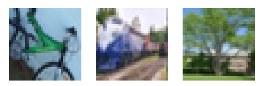

# Predicting the "odd-one-out" on a triplet task

## Cifar-100 triplet task
Generate triplets by combining two samples of Cifar100 with the same coarse label (20 labels) and one "odd-one-out" 
with a different coarse label. This results for example in the following triplet:


with bike and train being in the same coarse category and tree being the odd one out.


## Research Questions/Ideas
* How does the pre-training task affect accuracy? (supervised vs. self-supervised learning)
* How does model size/embeddings size affect accuracy?
* Does scaling really help to peform close to human-level intelligence?
* How does model architecture affect accuracy? (e. g. VGGs vs. ResNets vs. ViTs)
* Which models make the same mistakes?
* Linear probing on top of representations/finetuning
* Can we correlate accuracy with CKA similarity of representations?
* How uniformly do models make mistakes vs. humans?
* Fine-tune each model on THINGS (multi-class classification) and then compare models against humans?
* Predict the similarity space of a different model (use predictions of one model as label).
* Do self-supervised learning on then THINGS dataset and then measure the performance.

## Usage

Run evaluation on things triplet task with Imagenet pretrained Resnet18 and Resnet50.

```
python main_triplet_eval.py --models resnet18 resnet50 \
--dataset things \
--data_root /home/space/datasets/things \
--out-file results.csv
```


## Results
| Model                 | Things | Cifar-100-0 | #parameters | Imagenet Accuracy |
|-----------------------|--------|-------------|-------------|-------------------|
| Resnet 18             | 47.33  | 62.09       |             | 69.758            |
| Resnet 50             | 47.74  | 64.75       |             | 76.130            |
| Resnet 50 BarlowTwins | 43.84  | 59.72       |             | 73.5              |
| Resnet 152            | 47.24  | 68.32       |             | 78.312            |
| Vit-B 16              | 50.89  | 75.8        |             | (81.072)          |
| VGG 19                | 51.83  | 66.49       |             | 74.218            |
